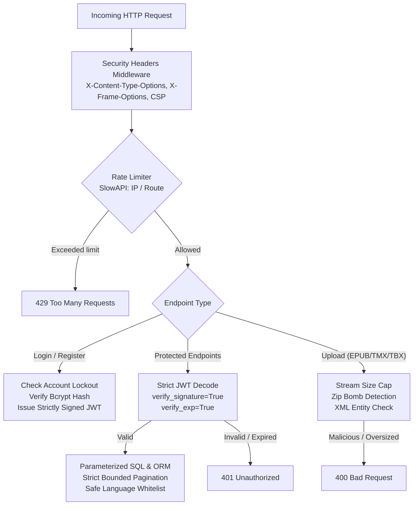

# Backend Security Hardening Specification & Plan

Meningkatkan postur keamanan backend AI EPUB Translator secara menyeluruh dengan mengatasi celah autentikasi, brute force attack, SQL injection, manipulasi CORS/header HTTP, serta kerentanan file upload (Zip Bomb & XML Entity Expansion).

---

## User Review Required

> [!CRITICAL] > **1. Perbaikan Celah Kritis JWT Signature Bypass:**
> Pada `backend/app/core/security_auth.py`, terdapat fallback `jwt.decode(token, options={"verify_signature": False})`. Celah ini memungkinkan token yang expired atau token palsu tanpa signature valid tetap diterima. Fallback ini **wajib dihapus total** agar semua token harus memiliki signature kriptografis yang valid dan belum expired.

> [!IMPORTANT] > **2. Rate Limiting & Account Lockout:**
>
> - Integrasi `slowapi` (dengan fallback in-memory dan opsi Redis jika tersedia).
> - `/api/auth/login`: Dibatasi 5 percobaan per menit per IP, ditambah fitur **Account Lockout / Delay Backoff** jika gagal 5 kali berturut-turut (terkunci selama 15 menit).
> - `/api/auth/register`: Dibatasi 3 pendaftaran per menit per IP.
> - `/api/auth/guest`: Dibatasi 5 sesi tamu per jam per IP (mencegah spam pembuatan guest project & database exhaustion).
> - Global API limit: 120 requests/menit per IP.

> [!IMPORTANT] > **3. Pengetatan CORS:** > `allow_origins=["*"]` dengan `allow_credentials=True` tidak aman dan melanggar spesifikasi browser. Akan diubah menjadi daftar origin terkonfigurasi melalui `.env` (`ALLOWED_ORIGINS`), dengan default `["http://localhost:3000", "http://localhost:5173", "http://127.0.0.1:3000", "http://127.0.0.1:5173"]`.

---

## Proposed Changes



---

### Component 1: Authentication & Token Security Hardening

#### [MODIFY] [security_auth.py](file:///home/salman/Dokumen/Projects/epub-translator-project/backend/app/core/security_auth.py)

- Hapus total fallback `options={"verify_signature": False}`.
- Pastikan opsi `verify_exp: True` dan algoritma yang diizinkan hanya `[settings.JWT_ALGORITHM, "HS256"]`.
- Tangani `jwt.ExpiredSignatureError` dan `jwt.InvalidTokenError` secara eksplisit, kembalikan `None`.

#### [MODIFY] [schemas/user.py](file:///home/salman/Dokumen/Projects/epub-translator-project/backend/app/schemas/user.py)

- Tambahkan validasi kompleksitas password pada `UserCreate`:
  - Minimal 8 karakter, maksimal 128 karakter.
  - Memiliki setidaknya 1 huruf besar, 1 huruf kecil, dan 1 angka.
- Sanitasi email dengan lowercase dan pemangkasan spasi.

---

### Component 2: Brute Force & Abuse Protection

#### [MODIFY] [requirements.txt](file:///home/salman/Dokumen/Projects/epub-translator-project/backend/requirements.txt)

- Tambahkan library rate limiting: `slowapi>=0.1.9`.

#### [NEW] [rate_limiter.py](file:///home/salman/Dokumen/Projects/epub-translator-project/backend/app/core/rate_limiter.py)

- Inisialisasi instance `Limiter` dengan storage strategy:
  - Gunakan `REDIS_URL` jika Redis aktif dan dapat diakses.
  - Fallback otomatis ke in-memory storage jika Redis tidak tersedia/down, sehingga test suite dan local dev tetap berjalan mulus tanpa error.
- Helper client IP resolver yang aman (memvalidasi format IP dan opsi trusted proxy header).

#### [NEW] [login_guard.py](file:///home/salman/Dokumen/Projects/epub-translator-project/backend/app/core/login_guard.py)

- Service pelacak kegagalan login (Account Lockout):
  - Melacak kegagalan login per kombinasi `email` dan `IP`.
  - Jika terjadi **5 kegagalan berturut-turut**, akun/IP dikunci selama **15 menit**.
  - Jika login berhasil, reset counter kegagalan ke 0.

#### [MODIFY] [api/auth.py](file:///home/salman/Dokumen/Projects/epub-translator-project/backend/app/api/auth.py)

- Tambahkan decorator `@limiter.limit("5/minute")` pada `/login`.
- Tambahkan pengecekan `LoginGuard.is_locked(data.email, client_ip)` sebelum memverifikasi password.
- Tambahkan decorator `@limiter.limit("3/minute")` pada `/register`.
- Tambahkan decorator `@limiter.limit("5/hour")` pada `/guest`.

---

### Component 3: SQL Injection Prevention & Query Parameter Hardening

#### [MODIFY] [services/semantic_tm_service.py](file:///home/salman/Dokumen/Projects/epub-translator-project/backend/app/services/semantic_tm_service.py)

- Validasi input `source_language` dan `target_language` dengan regex `^[a-zA-Z0-9_\-]{2,20}$` untuk mencegah karakter anomali masuk ke parameter query.
- Batasi parameter `limit` secara eksplisit: `limit = min(max(1, limit), 50)`.

#### [MODIFY] [repositories/project_repository.py](file:///home/salman/Dokumen/Projects/epub-translator-project/backend/app/repositories/project_repository.py) & [api/projects.py](file:///home/salman/Dokumen/Projects/epub-translator-project/backend/app/api/projects.py)

- Batasi `limit` dan `offset` pada seluruh query list menggunakan Pydantic query parameters: `limit: int = Query(default=50, ge=1, le=100)` dan `offset: int = Query(default=0, ge=0)`. Mencegah DoS akibat permintaan limit jutaan baris data.

---

### Component 4: Transport, CORS & Security Headers

#### [MODIFY] [core/config.py](file:///home/salman/Dokumen/Projects/epub-translator-project/backend/app/core/config.py)

- Tambahkan setting `ALLOWED_ORIGINS: list[str] | str = "http://localhost:3000,http://localhost:5173,http://127.0.0.1:3000,http://127.0.0.1:5173"`.
- Buat property method untuk mem-parsing daftar origin jika dikirim sebagai string dipisah koma.

#### [NEW] [middleware/security_headers.py](file:///home/salman/Dokumen/Projects/epub-translator-project/backend/app/middleware/security_headers.py)

- Middleware kustom untuk menyuntikkan header keamanan pada setiap respons HTTP:
  - `X-Content-Type-Options: nosniff`
  - `X-Frame-Options: DENY`
  - `X-XSS-Protection: 1; mode=block`
  - `Referrer-Policy: strict-origin-when-cross-origin`
  - `Strict-Transport-Security: max-age=31536000; includeSubDomains` (jika menggunakan SSL/HTTPS)
  - `Cache-Control: no-store` khusus untuk rute `/api/auth/*`.

#### [MODIFY] [main.py](file:///home/salman/Dokumen/Projects/epub-translator-project/backend/app/main.py)

- Pasang `SecurityHeadersMiddleware`.
- Daftarkan exception handler `RateLimitExceeded` dari SlowAPI.
- Ganti `allow_origins=["*"]` dengan `settings.get_allowed_origins()`.

---

### Component 5: File Upload & Decompression Bomb (Zip Bomb) Protection

#### [MODIFY] [services/epub_service.py](file:///home/salman/Dokumen/Projects/epub-translator-project/backend/app/services/epub_service.py)

- Tambahkan inspeksi komprehensif pada `EpubParser.parse()` sebelum mengekstrak arsip:
  - **Maksimal total ukuran uncompressed:** Maksimal 250 MB.
  - **Maksimal rasio kompresi:** Jika rasio `uncompressed_size / max(compressed_size, 1) > 100`, tolak arsip sebagai indikasi Zip Bomb.
  - **Maksimal jumlah file dalam arsip:** Maksimal 5.000 file.
- **XML Entity Defense:** Tolak file XML dalam EPUB yang mengandung deklarasi entitas berbahaya (`<!ENTITY` atau `<!DOCTYPE` kustom yang berpotensi Billion Laughs attack).

#### [MODIFY] [api/tm.py](file:///home/salman/Dokumen/Projects/epub-translator-project/backend/app/api/tm.py) & [api/glossary.py](file:///home/salman/Dokumen/Projects/epub-translator-project/backend/app/api/glossary.py)

- Batasi ukuran file upload TMX/TBX/JSON/CSV maksimal 25 MB sebelum memuat ke memori.
- Tolak konten XML jika terdeteksi deklarasi `<!ENTITY` eksternal/rekursif.

---

## Verification Plan

### Automated Tests

Jalankan pengujian keamanan backend menggunakan Pytest:

```bash
cd backend
PYTHONPATH=. ../.venv/bin/pytest tests/unit/test_security_hardening.py -v
PYTHONPATH=. ../.venv/bin/pytest tests/unit/test_auth_tenant_isolation.py -v
PYTHONPATH=. ../.venv/bin/pytest tests/unit/test_byok_security.py -v
PYTHONPATH=. ../.venv/bin/pytest tests/unit/test_epub_parser.py -v
```

Kasus uji pada `test_security_hardening.py` mencakup:

1. **JWT Signature Tampering & Expiry**: Verifikasi token yang dipalsukan atau kedaluwarsa 100% ditolak (`None` / 401).
2. **Rate Limiting**: Kirim 6 request beruntun ke `/api/auth/login`, pastikan request ke-6 mengembalikan status code `429 Too Many Requests`.
3. **Account Lockout**: Simulasikan 5 kali kegagalan password berturut-turut, pastikan akun terkunci dan login berikutnya langsung ditolak tanpa verifikasi hash.
4. **Password Policy**: Verifikasi pendaftaran dengan password lemah ditolak dengan status code `422 Unprocessable Entity`.
5. **Security Headers**: Verifikasi respons API menyertakan `X-Content-Type-Options`, `X-Frame-Options`, dan `Referrer-Policy`.
6. **Zip Bomb & XML Entity Attack Prevention**:
   - Uji coba file zip craft dengan rasio kompresi tinggi (> 100x), pastikan ditolak dengan `InvalidEpubError`.
   - Uji coba file XML yang mengandung `<!ENTITY ...>`, pastikan ditolak.
7. **Pagination Limits**: Verifikasi query `limit=100000` atau `limit=-5` ditolak oleh validasi FastAPI/Pydantic.

### Manual Verification

1. Lakukan request cURL ke `http://localhost:8000/api/auth/login` berkali-kali untuk melihat respons header `Retry-After` dan status `429`.
2. Inspect header HTTP dari respons health check `http://localhost:8000/health` untuk memverifikasi presence `X-Frame-Options` dan `X-Content-Type-Options`.
